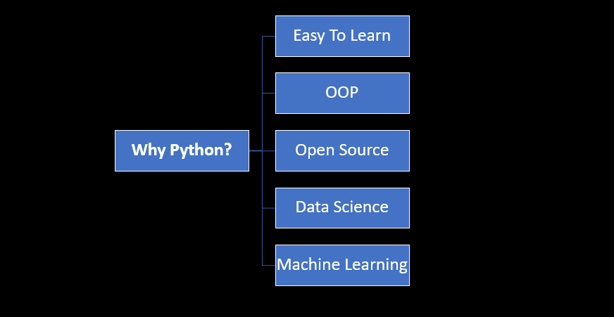

# Python_Tutorial
These are the codes I've used in my Python tutorial videos on my YouTube channel.

# Let's Code Together <>

# First Part: Python Fundamentals 
- Video1: <a href="https://www.youtube.com/watch?v=WxHhW1fCWak&t=80s">YouTube</a>
- Video2: <a href="https://youtu.be/llQRe-yrPVg">YouTube</a>
